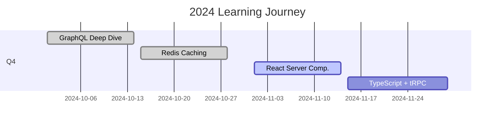

# Learning in Public 🚀

> **My journey of learning by building, documenting what I understand, and sharing it all.**

[](https://github.com/yourusername)
[](https://twitter.com/yourusername)

---

## 🎯 Current Focus

**This Week:** [Topic you're learning]  
**Building:** [Current project]  
**Goal:** [What you want to understand]

📊 **Progress:** Week X of 2024  
⏱️ **Time Invested:** XX hours this week  
📝 **Latest Post:** [Link to latest explanation]

---

## 📚 What I've Learned

> **Feynman Technique:** If I can't explain it simply, I don't understand it yet.

### Recent Explanations
1. **[Topic Name](./learned/topic-name.md)** - One-line summary
2. **[Topic Name](./learned/topic-name.md)** - One-line summary
3. **[Topic Name](./learned/topic-name.md)** - One-line summary

### By Category

**Backend**
- [GraphQL Basics](./learned/graphql-basics.md)
- [Redis Caching](./learned/redis-caching.md)

**Frontend**
- [React Server Components](./learned/react-server-components.md)

**DevOps**
- [Docker Networking](./learned/docker-networking.md)

[See all explanations →](./learned/)

---

## 🛠️ What I've Built

> **Learning by doing:** Every project teaches me something new.

### Recent Projects
1. **[Project Name](./built/project-name.md)** - What it does (Tech stack)
2. **[Project Name](./built/project-name.md)** - What it does (Tech stack)
3. **[Project Name](./built/project-name.md)** - What it does (Tech stack)

[See all projects →](./built/)

---

## 📈 Progress Timeline



---

## 📊 Stats

**2024 Totals:**
- 📝 Concepts Explained: XX
- 🛠️ Projects Built: XX
- ⏱️ Hours Invested: XXX
- 💻 Commits Made: XXX
- 🌟 GitHub Stars: XX

**Current Streak:** XX days 🔥

---

## 🗓️ Weekly Logs

> **Weekly reflection:** What I learned, built, and struggled with.

- [Week 52 - Dec 23-29](./daily/2024-week-52.md) - [Topic focus]


[See all weeks →](./daily/)

---

## 🎨 Visual Learning

> **Diagrams make complex ideas simple.**


All diagrams created with:
- [Mermaid](https://mermaid.js.org/) for simple flows
- [Excalidraw](https://excalidraw.com/) for concept explanations

[See all diagrams →](./diagrams/)

---

## 📖 Curated Resources

> **The best resources I've found, and what they're missing.**

- [Backend Resources](./resources/backend.md)
- [Frontend Resources](./resources/frontend.md)
- [DevOps Resources](./resources/devops.md)

---

## 🎯 Learning Philosophy

**My Rules:**
1. **Learn by building** - No tutorial hell
2. **Explain simply** - If I can't explain it, I don't understand it
3. **Document gaps** - What tutorials don't tell you
4. **Share everything** - Someone else needs this
5. **Focus deeply** - One topic at a time

**My Process:**
```
Monday-Friday: Learn + Build (commit daily)
Saturday: Document (write + diagram)
Sunday: Share + Plan next week
```

---

## 🚀 Tech Stack I'm Exploring

**Languages:** JavaScript/TypeScript, Python, Go  
**Frontend:** React, Next.js, Svelte  
**Backend:** Node.js, Express, tRPC  
**Databases:** PostgreSQL, Redis, MongoDB  
**DevOps:** Docker, Kubernetes, GitHub Actions  
**Tools:** Git, VSCode, Excalidraw

---

## 💬 Connect

**Ask me about:** [Topics you're confident in]  
**Learning next:** [What's coming up]  
**DMs open for:** Questions, collaboration, feedback

- 🐦 Twitter: [@yourusername](https://twitter.com/yourusername)
- 💼 LinkedIn: [Your Name](https://linkedin.com/in/yourname)
- 📧 Email: your.email@example.com

---

## 📝 How to Use This Repo

**For Learners:**
1. Browse [learned/](./learned/) for concept explanations
2. Check [built/](./built/) for project examples
3. Read [daily/](./daily/) for weekly reflections

**For Recruiters:**
- See [built/](./built/) for technical projects
- Check commit history for consistency
- Review [learned/](./learned/) for communication skills

**Want to learn in public too?**
- Fork this repo structure
- Copy [templates/](./templates/) to get started
- Tag me when you share - I'll cheer you on!

---

## ⭐ Support

If this helped you:
- ⭐ Star this repo
- 🐦 Share on Twitter
- �� Write your own learning in public

---

## 📜 License

MIT License - Feel free to use this structure for your own learning journey!

---

**Last Updated:** 2025-12-26  
**Current Project:** [Link to current project]  
**Next Topic:** [What you're learning next]
