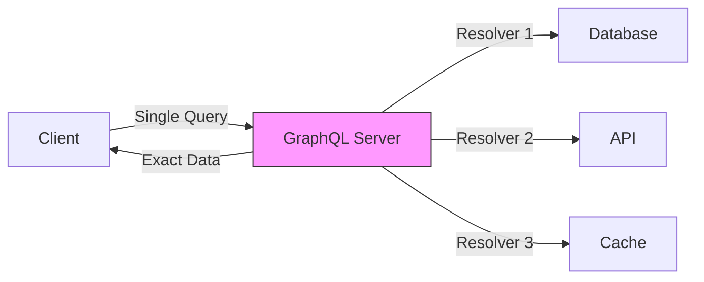

# GraphQL Basics

> **One-liner:** Query language that lets clients request exactly the data they need.

**Status:** ✅ Understood | 📝 Explained  
**Date:** 2024-12-26  
**Related Project:** [GraphQL API Project](../built/graphql-api-project.md)

---

## The Problem (ELI5)

Imagine you're at a restaurant with only set menus. You want just a burger, but every combo comes with fries and a drink you don't want. You waste food and pay for stuff you don't use.

> **GraphQL is like ordering a custom meal** - you pick exactly what you want, nothing more, nothing less. With REST APIs, you get fixed "combos" of data. With GraphQL, you build your own plate.

---

## How It Works (Core Concept)

```javascript
// REST: Multiple requests, over-fetching
fetch('/users/1')           // Get user (includes unnecessary fields)
fetch('/users/1/posts')     // Get posts
fetch('/posts/1/comments')  // Get comments

// GraphQL: One request, exact data
query {
  user(id: 1) {
    name
    email
    posts {
      title
      comments {
        text
        author
      }
    }
  }
}
```

**Why this matters:**
Instead of making 3 separate API calls and getting tons of data you don't need, you make ONE request and get EXACTLY what you asked for. This is huge for mobile apps where network speed matters.

---

## The Diagram



**What this shows:**
The GraphQL server acts as a smart middleman. One query can fetch from multiple sources (database, APIs, cache), but the client only gets exactly what it asked for in a single response.

---

## What Tutorials Skip (The Gaps I Filled)

### Gap 1: GraphQL vs REST isn't about "better"
- **Why it's confusing:** Everyone says "GraphQL replaces REST" but doesn't explain when
- **The simple explanation:** Use GraphQL when clients need flexible data (mobile apps, dashboards). Use REST when you have simple, predictable endpoints (webhooks, public APIs)
- **When it matters:** If you're building a simple CRUD app, REST is fine. If you're building a mobile app that needs different data on different screens, GraphQL shines

### Gap 2: The N+1 problem will bite you
- **Why it's confusing:** Tutorials show simple queries but don't warn about performance issues
- **The simple explanation:** Each nested field can trigger a separate database query. Without DataLoader, fetching 100 users with their posts means 101 queries (1 for users + 100 for posts)
- **When it matters:** Production apps with real traffic. Always use DataLoader or equivalent batching

---

## When to Use This (vs Alternatives)

| Use GraphQL | Use REST |
|-------------|----------|
| Mobile apps with varying data needs | Simple CRUD APIs |
| Complex nested data structures | Public APIs (easier to document) |
| Multiple clients with different needs | Simple microservices |
| Real-time with subscriptions | File uploads (simpler with REST) |

---

## Quick Reference (The Essentials)

```javascript
// Basic Schema
type User {
  id: ID!
  name: String!
  email: String!
  posts: [Post!]!
}

type Post {
  id: ID!
  title: String!
  content: String!
  author: User!
}

// Basic Resolver
const resolvers = {
  Query: {
    user: (parent, { id }, context) => {
      return context.db.users.findById(id);
    }
  },
  User: {
    posts: (user, args, context) => {
      return context.db.posts.findByUserId(user.id);
    }
  }
};
```

---

## Resources That Actually Helped

⭐⭐⭐ [How to GraphQL](https://www.howtographql.com/) - Best starting point  
⭐⭐ [Apollo Docs](https://www.apollographql.com/docs/) - Deep dive after basics  
⭐ [GraphQL Official](https://graphql.org/learn/) - Too theoretical, read after building  

**What each missed:**
- How to GraphQL: Doesn't cover N+1 problem well
- Apollo Docs: Overwhelming, too many features at once
- GraphQL Official: Too abstract, needs more examples

---

## Next Steps

- [x] Build basic GraphQL API
- [ ] Try subscriptions for real-time data
- [ ] Learn federation for microservices

---

**Connected Concepts:** [[apollo-client]] • [[dataloader]] • [[graphql-subscriptions]]  
**Built With This:** [GraphQL API Project](../built/graphql-api-project.md)  
**Published:** [Tweet link]
